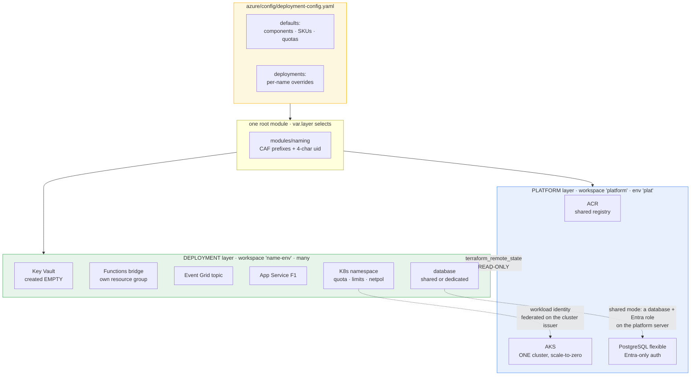
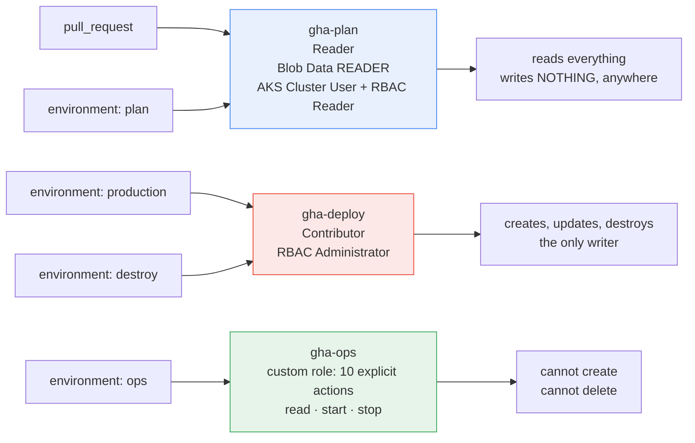
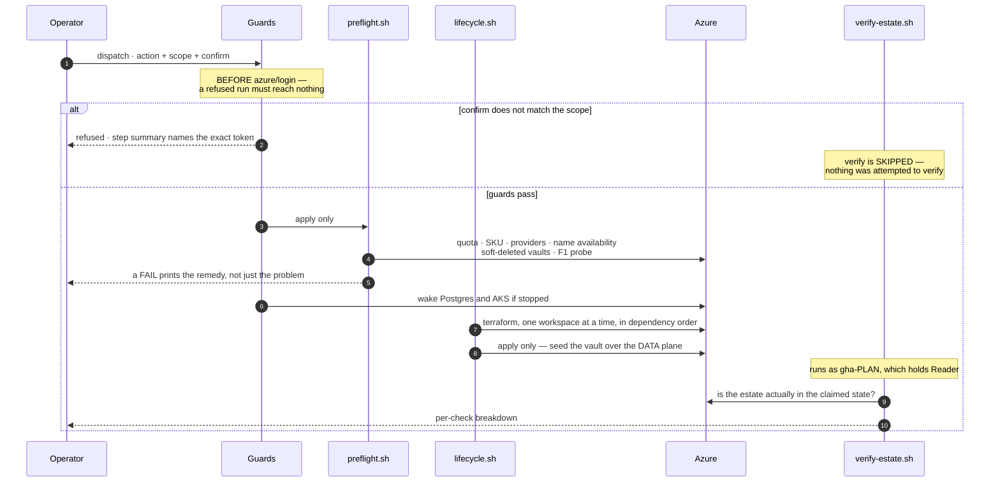
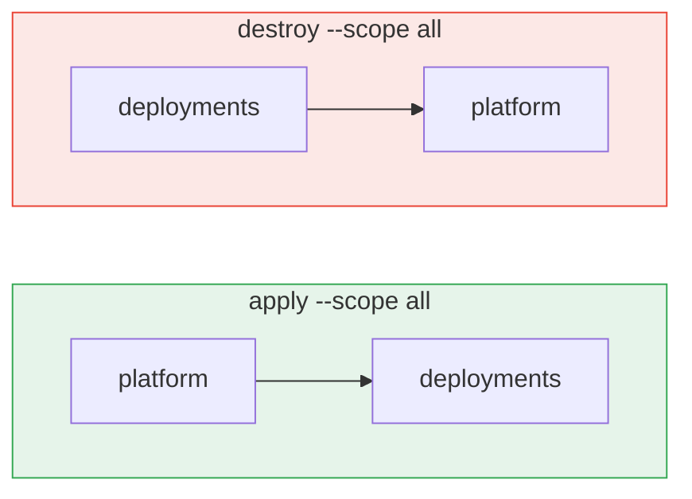
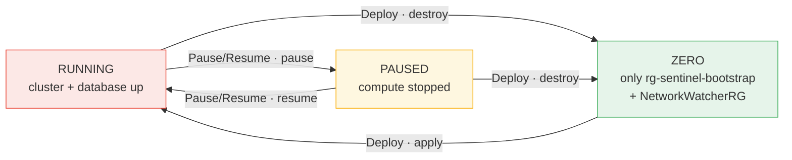

# Sentinel-infra

Terraform for the Sentinel platform. One root module, **two layers**, eight child modules, three
CI identities, and four workflows — on a 6-vCPU student subscription that must be able to reach
**zero cost** on demand and come back.

> **The runbook is not here.** Ordered bootstrap steps, teardown, and day-2 operations live in
> [docs/BOOTSTRAP.md](docs/BOOTSTRAP.md). Keeping them in one place is deliberate — a runbook
> duplicated across two files is a runbook where one copy is quietly wrong, and the wrong copy
> is the one someone follows at 2am.

---

## 1. The shape, in one picture

Everything below follows from a single constraint: **the subscription has 6 vCPU regionally and
an AKS node costs 2.** A cluster per deployment is arithmetically impossible. So the estate
splits into one expensive singleton and many cheap tenants.



**Why two layers and not two root directories.** Two roots means two provider blocks, two lock
files and two `init` paths to keep in step, for one boolean's worth of separation. The layers
are separated where it actually matters — **in state**. `platform` is its own workspace; each
deployment is its own workspace. That is a safety property, not a preference: in a single state,
destroying a deployment would take the shared cluster with it.

The deployment layer reads the platform through `terraform_remote_state`, which is read-only by
construction. A deployment can *use* the cluster and *cannot* change it.

---

## 2. Repository map

```
.
├── main.tf                providers · config merge · the layer switch · guards
├── platform.tf            RG + ACR + AKS + Postgres                     (layer = platform)
├── deployment.tf          RG + KV + Functions + EventGrid + AppService  (layer = deployment)
├── namespace.tf           K8s namespace, quota, LimitRange, NetworkPolicy, ServiceAccount
├── database.tf            shared    -> a database on the platform server
│                          dedicated -> a flexible server of its own
├── outputs.tf             platform outputs + the platform_* mirrors a deployment reads
├── variables.tf           inputs; location may override the YAML, nothing else may
├── backend.tf             remote state (azurerm, OIDC)
├── versions.tf            provider pins
│
├── azure/config/deployment-config.yaml    size and detail — SKUs, counts, retention
├── modules/               acr · aks · app-service · event-grid · functions
│                          keyvault · naming · postgresql
├── scripts/               the eight below
├── ci-images/             CI runner image + its one-time bootstrap push
└── .github/workflows/     four workflows
```

| Script | Runs as | What it is for |
|---|---|---|
| `bootstrap-state.sh` | you, as Owner | one-time: the state storage account |
| `bootstrap-identities.sh` | you, as Owner | one-time: the three UAMIs, their roles, their federated credentials |
| `set-gh-secrets.sh` | you | pushes repo variables/secrets to the three repos |
| `preflight.sh` | `gha-plan` or `gha-deploy` | the checks a `plan` structurally cannot make |
| `lifecycle.sh` | `gha-deploy` | plan / apply / destroy, **in dependency order** |
| `seed-vault.sh` | `gha-deploy` | fills the empty vault over the data plane, post-apply |
| `verify-estate.sh` | `gha-plan` | asks Azure what actually survived |
| `pause.sh` | `gha-ops` | stop and start compute without deleting anything |

---

## 3. The form / file split

`workflow_dispatch` accepts at most **10 inputs**. The stack has roughly forty knobs. The split
is forced, not stylistic:

| | carries | lives in |
|---|---|---|
| **the form** | shape and intent — which deployment, apply or destroy | workflow inputs |
| **the file** | size and detail — SKUs, counts, retention, quotas | `deployment-config.yaml` |

The better half of the accident: **config in git is reviewable.** A SKU change arrives as a diff
with an author and a date, instead of as something someone typed into a form six weeks ago and
cannot recall.

A deployment absent from `deployments:` is completely valid and inherits `defaults:` entirely —
which is what makes `deployment: demo1` plus `apply` a whole instruction with no file edit. The
file is for **exceptions, not enrolment**. `merge` is shallow, so an override of `database:`
replaces the whole block: state every key you need.

### Naming

`modules/naming` derives every name from `deployment`, `environment` and a 4-char `uid` hashed
from the subscription id. Prefixes are Cloud Adoption Framework abbreviations, not inventions.

| Resource | Pattern | Example |
|---|---|---|
| resource group | `rg-<dep>-<env>-<loc>` | `rg-demo1-dev-cc` |
| functions RG | `rg-<dep>-<env>-func-<loc>` | `rg-demo1-dev-func-cc` |
| Key Vault | `kv-<dep>-<env>-<uid>` | `kv-demo1-dev-8baf` |
| Postgres | `psql-<dep>-<env>-<uid>` | `psql-sentinel-plat-2fef` |
| ACR / storage | `acr<dep><env><uid>` / `st<dep><env><uid>` | `stdemo1dev8baf` |
| App Service plan | `asp-<dep>-<env>` | scoped per RG, so no uid |

`uid` exists because App Service, storage and ACR names are **globally unique across every Azure
customer** — `acrsentineldev` is a name someone else certainly owns.

---

## 4. Identity — three, not one

Every workflow job declares a GitHub `environment`, and that is the security boundary. Declaring
`environment: X` rewrites the OIDC subject to `repo:<owner>/<repo>:environment:X`, replacing the
branch form. Those are the only subjects the identities federate on, and **GitHub will not mint
an `environment:` subject for a `pull_request` event** — so the identity that can empty the
subscription is unreachable from a PR *by construction*, not by a rule someone could
misconfigure.



Apply and destroy use **different environments**, so a required reviewer can be attached to
destruction alone. `gha-ops` runs the most frequent operation in the repo — pause/resume — and
therefore must not be the identity that can delete the subscription. Its role
([`.ops-role.json`](.ops-role.json)) lists ten explicit actions with no wildcard anywhere: a
property you can test rather than trust.

> **`identity.tf` is deleted, not disabled.** Terraform *configures* a declared provider whether
> or not any of its resources are planned — `count = 0` on everything is not enough. An
> `azuread` provider that cannot authenticate to the second tenant therefore broke **every**
> plan, including the platform's, with an error about the identity tenant that had nothing to do
> with what you were changing. The per-deployment app registrations are written and work
> (commit `65e35b9`); they return when `sentinel-tf-identity` carries federated credentials for
> the `environment:*` subjects.

---

## 5. Workflows

| Workflow | File | Runs as | Trigger |
|---|---|---|---|
| **Sentinel Infra — Validate & Plan** | `ci_infra_dry.yml` | `gha-plan` | every push · PRs to `main` · manual |
| **Sentinel Infra — Deploy** | `ci_infra.yml` | `gha-deploy` | **dispatch only** |
| **Sentinel — Pause / Resume** | `ci_pause.yml` | `gha-ops` | dispatch |
| **Runner Image — Build & Deploy to ACR** | `ci_runners.yml` | `gha-deploy` | push to `ci-images/**` · manual |

**Deploy is dispatch-only, and that is a consequence rather than a preference.** Push-to-main
auto-apply cannot survive multi-deployment: a push has no way to know *which* deployment it
means, and no identity carries a branch subject any more.

**Every run names its target.** `run-name` is evaluated at dispatch time, so
`Sentinel Infra · destroy · demo1-dev` is the title in the Actions list before a single job
starts — and it survives a run that fails in its first step. Four identically-named runs is an
unreadable audit trail precisely when you most need to read one.

### What a Deploy run actually does



Three properties worth naming:

- **Guards run before authentication.** A refused run costs nothing and mints no token.
- **The verifier cannot fix its own findings.** It runs as `gha-plan`, which holds Reader. A
  verifier able to repair what it is checking is not a verifier.
- **Verify only asserts an outcome that was actually attempted.** It is `always()` — a run that
  failed *halfway* is exactly when you most need to know what survived — but gated on the guards
  having passed. Without that gate a refused destroy reported "`rg-sentinel-dev-cc` still
  exists" as a hard failure, which is a correct state described as a fault.

### Destroy ordering is asymmetric, and that is the point



A dependency must exist before its dependents and must outlive them. Tearing the platform down
first orphans every deployment's state: the resources are gone, the state still claims them, and
no later destroy can reconcile it. `lifecycle.sh` enforces the order in a bash sequence rather
than a job matrix — GitHub does not guarantee matrix ordering even at `max-parallel: 1`, and
here the ordering *is* the safety property.

### Destroying: the confirm token

The token differs per scope deliberately — it names the blast radius, so one memorised for a
narrow scope cannot fire a wider one.

| `scope` | type into `confirm` |
|---|---|
| `deployment` | the deployment name, e.g. `demo1` |
| `platform` | `platform` |
| `all` | `destroy-everything` |

A mismatch refuses in about two seconds, before Azure is touched, and writes the exact expected
token to the run summary — so the remedy is on the run page, not six scrolls into a collapsed
log.

---

## 6. Two things that surprise people

**1. Postgres has no password.** Authentication is Entra-only. There is no `DB_PASSWORD` secret,
variable, or Key Vault entry anywhere in this repo, and adding one would be a defect rather than
a convenience.

```bash
PGPASSWORD="$(az account get-access-token \
  --resource-type oss-rdbms --query accessToken -o tsv)" \
  psql "host=<postgres_fqdn> user=<your-upn> dbname=sentinel sslmode=require"
```

**2. Terraform creates the Key Vault empty, and that invariant holds.** No secret value is ever a
Terraform input, a variable, or a state entry. Seeding happens one step *after* the apply, over
the **data** plane, from GitHub environment secrets — a different plane, a different credential,
and nothing lands in state.

---

## 7. Preflight — the checks a plan cannot make

A plan proves auth works, state is readable, config is valid, and what would change. It does
**not** prove an apply will succeed. Every check maps to a failure this project actually hit:

| Check | The failure it prevents |
|---|---|
| regional vCPU quota | the 6-vCPU ceiling that decided the whole architecture |
| AKS node SKU | three SKUs were rejected before `B2pls_v2` was found |
| provider registration | ten had to be registered by hand on a fresh subscription |
| Postgres running | `400 ServerStoppedError` broke a run three times |
| Key Vault name free | a destroyed vault holds its name for 7 days |
| storage name free | `sentineltfstate` was already taken by another tenant |
| **App Service F1 quota** | `Current Limit (F1 VMs): 0` killed an apply **14 minutes in** |

The F1 check is a **live probe** — create a Free plan, read the answer, delete it — because no
read-only API tells the truth. `Microsoft.Web/locations/<loc>/usages` answers `501
MethodNotAllowed`; `Microsoft.Web/.../validate` answers `{"status":"Success"}` at limit 0; and
`az appservice list-locations --sku F1` lists the region regardless. The probe name is fixed
rather than random so a leak from a cancelled run is self-healing, and it is deleted from an
`EXIT` trap as well as inline. Apply-mode only: `gha-plan` holds no write action and would fail
it on RBAC, which would be a false alarm of exactly the kind preflight exists to end.

**A check that says "no" without saying "run this" has moved the problem rather than solved it** —
so every failure prints its remedy.

---

## 8. Cost, and reaching zero



**Pause is not free, and the summary says so.** Stopping ends the compute charge, which
dominates — but disks, storage, the AKS load balancer and ACR's daily charge continue. Only
destroy is zero.

What survives a `destroy --scope all` is `rg-sentinel-bootstrap` (Terraform state plus the three
managed identities) and `NetworkWatcherRG`. Both are $0: managed identities are free, Network
Watcher is free and Azure recreates it regardless, and the state blobs are a few KB. **If the
verify job is green after a full destroy, the estate costs nothing.**

---

## 9. Root outputs

| Output | Consumed by |
|---|---|
| `layer`, `names` | diagnostics — when a global name collides, this is what to compare |
| `acr_login_server`, `acr_id` | backend CI image push; runner `container:` blocks; AcrPull grants |
| `aks_cluster_name`, `aks_resource_group` | `az aks get-credentials`; start/stop |
| `oidc_issuer_url` | the trust anchor for workload identity; diagnosing FIC mismatches |
| `postgres_fqdn`, `postgres_server_id` | backend `DATABASE_URL`; the deployment pipeline's Record step |
| `postgres_admin_principal` | so a deployment can grant its own role without re-deriving it |
| `platform_*` | the platform as seen from a deployment workspace — read-only |

The Event Grid access key is deliberately **not** an output; read it with
`az eventgrid topic key list`.

---

## 10. Local use

```bash
terraform init
terraform workspace select platform          # or <deployment>-<env>
terraform plan

bash ./scripts/preflight.sh --mode plan
cd modules/naming && terraform test && cd ../..
```

⚠️ **Start the database first.** A stopped Postgres makes `terraform plan` fail with `400
ServerStoppedError` — the provider must refresh admins, database and extensions, none of which
read while the server is down. A stopped AKS cluster is worse: it *plans* fine and fails the
**apply** with `OperationNotAllowed`. That asymmetry is why the Deploy workflow checks rather
than trusting a green plan.

⚠️ **CI runs Terraform only.** `tflint`, `shellcheck` and `gitleaks` are not run by any workflow
here — the quality gate lives in the `Sentinel` repo and infra CI does not reach across for it.
Run it before every push:

```bash
python ../Sentinel/scripts/quality_gate.py --repo infra --path .
```
